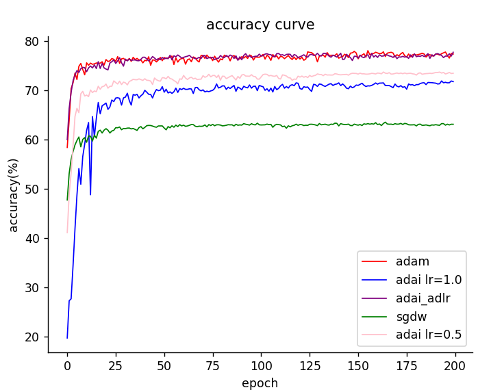
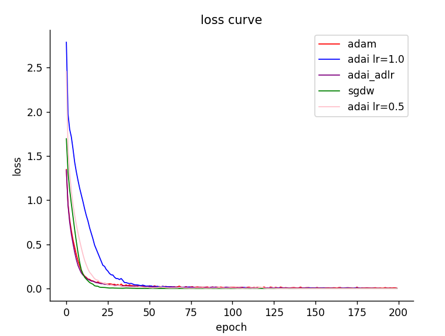

本项目比较了Adam、Adai、AdaptiveLR-Adai和SGDM四种优化算法的性能。

模型采用的是ResNet-18，损失函数为交叉熵损失函数，batchsize为128，数据集为CIFAR-10。

Adai算法基于论文Adaptive Inertia:Disentangling the Effects of Adaptive Learning Rate and Momentum。AdaptiveLR-Adai是我自己提出的将Adam的自适应学习率加入Adai的新算法。

## 超参数
Adam
|学习率|一阶矩估计衰减率 $\beta_1$ |二阶矩估计衰减率 $\beta_2$ |数值稳定性参数 $\epsilon$ |weight decay|
|---|---|---|---|---|
|0.001|0.9|0.999|1e-8|0|

Adai
|学习率|自适应动量调整参数 $\beta_0$ |二阶矩估计衰减率 $\beta_2$ |截断参数 $\epsilon$ |
|---|---|---|---|
|1.0和0.5|0.1|0.99|1e-3|

AdaptiveLR-Adai
|学习率|自适应动量调整参数 $\beta_0$ |二阶矩估计衰减率 $\beta_2$ |数值稳定性参数 $\epsilon$ |
|---|---|---|---|
|0.001|0.1|0.99|1e-3|

SGDM
|学习率|动量衰减率|weight decay|
|---|---|---|
|0.001|0.9|0|

